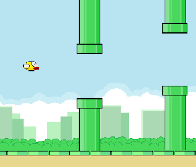
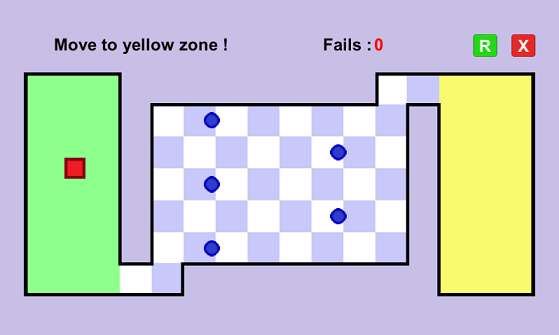
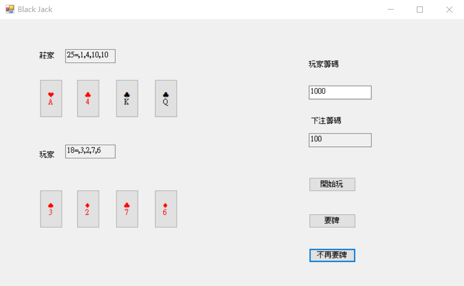

# 遊戲開發作品集
資料夾帶有 -exec 後綴的可以直接執行，若沒有請自行編譯專案 
.apk 檔案為 Android 手機安裝檔，建議在 16 : 9 解析度執行

 
 
 

---
 

## Flappy Bird

 
復刻經典遊戲 <a href="https://flappybird.io/">Flappy Bird</a>

#### 執行環境
Unity、Android

#### 玩法

空白鍵飛行
 
躲避障礙物
 
到達終點

 
 

---
 

## The World's Hardest Game

 
復刻網頁遊戲 <a href="https://www.crazygames.com/game/worlds-hardest-game">The World's Hardest Game</a> 第一關

#### 執行環境
Unity、Android

#### 玩法

方向鍵移動
 
到達指定區域
 
躲避障礙物
 

#### 更新紀錄

v1.0&nbsp;&nbsp;第一版 
v2.0&nbsp;&nbsp;增加虛擬搖桿和 apk 安裝檔

 

---
 

## Black Jack 二十一點

 

#### 執行環境
visual studio 2019 

#### 規則
J, Q, K 視為 10 點，A 可視為 1 或 11 點 
玩家持續要牌，接近 21 點時停止，換莊家要牌 
任一方超過 21 點落敗，未超過則較接近的人獲勝 
